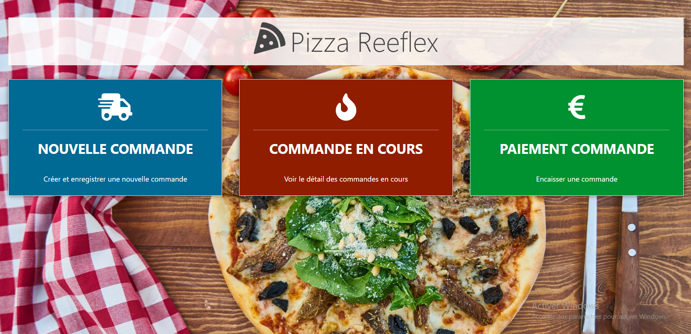
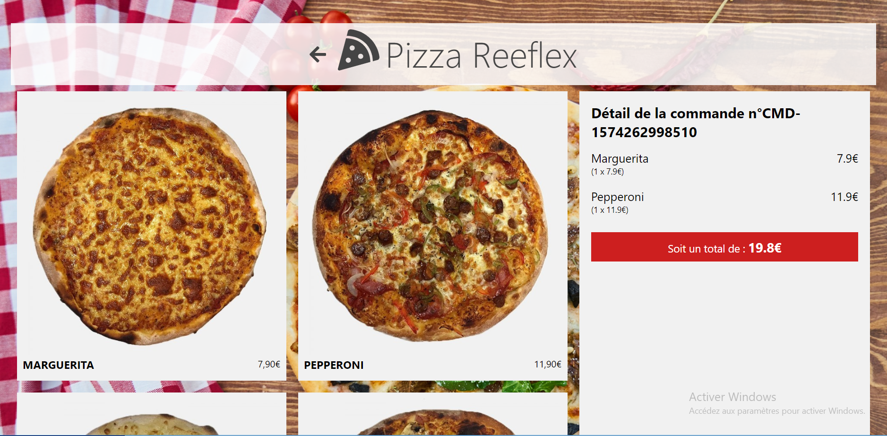
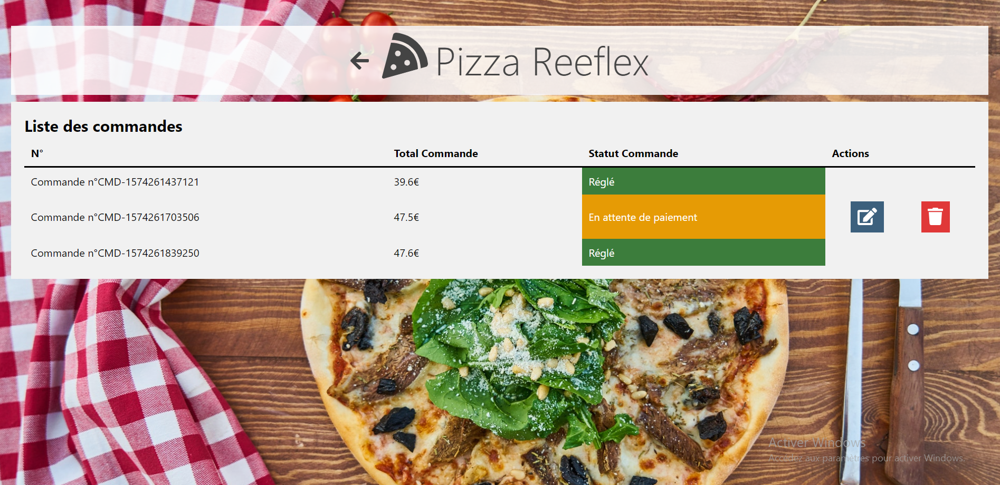
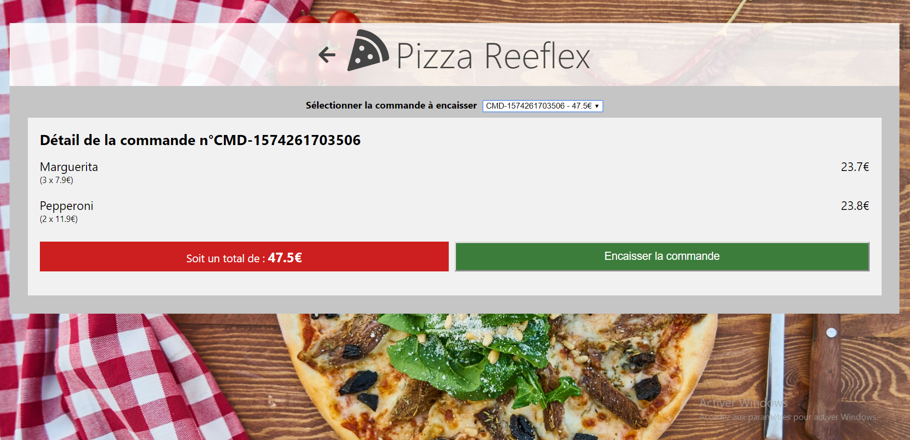

## Description

Travail pratique réalisé en autonomie après avoir découvert React et Redux ToolKit. Le but : créer une application de gestion de commandes, conçue ici pour les gérants d'une pizzeria. Cette application vous permet de prendre des commandes, de suivre les commandes en cours (réglées ou en attente) et de gérer le processus de paiement.
Nous avions une maquette de démarrage, mais le style pouvait être revu et personnalisé 😊🤘.

  
 

## Starter Pack 

## Contexte

Ce projet est le fruit d'une formation continue entamée en septembre 2023. Fort de mes acquis depuis lors, j'ai décidé de mettre en pratique mes compétences en React et Redux pour créer une application fonctionnelle et pertinente. Accompli en toute autonomie, ce projet a été développé en 3,5 jours. 

## Technologies Utilisées

- **React**: Bibliothèque JavaScript pour la construction de l'interface utilisateur.
- **Redux**: Gestion d'état pour une application React plus robuste.
- **Redux Toolkit**: Simplifiez la gestion de l'état avec des fonctionnalités comme createSlice et configureStore.
- **Strapi**: Utilisable comme CMS pour fournir des données via une API.

## Démarrage Rapide

1. Clonez le repository.
2. Installez les dépendances avec `npm install`.
3. Lancez l'application avec `npm start`.

## Configuration

- Configurez l'API ou la base de données locale dans le fichier de configuration.

## Contribution

Les contributions sont les bienvenues! N'hésitez pas à ouvrir une issue ou à soumettre une pull request.

**Happy Coding!**
